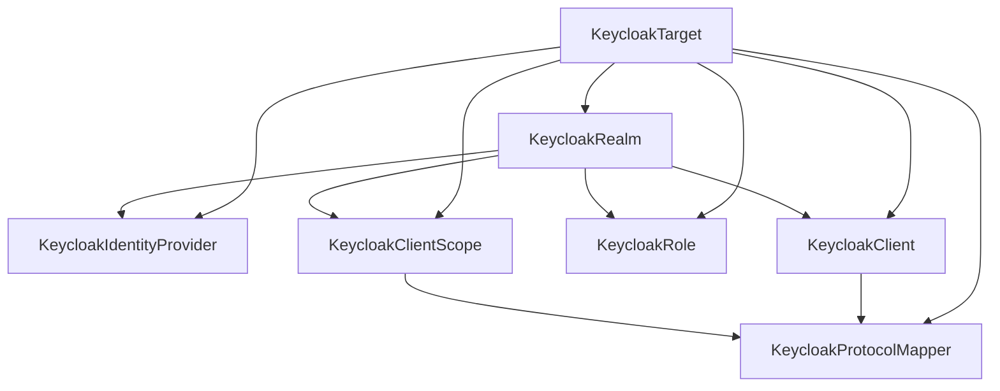

# Resources

The operator models a small, practical part of Keycloak as Kubernetes custom
resources. The goal is not to mirror every Keycloak screen. The goal is to make
the configuration that platform teams commonly need repeatable, reviewable, and
safe to apply from Git.

Use the resource pages in this section for operational guidance and examples.
Use the [API reference](../api-reference.md) when you need the complete schema.

## How To Think About The Resources

`KeycloakTarget` is the connection profile. Every other resource uses it to talk
to one Keycloak instance.

`KeycloakRealm` creates or observes the realm that contains the rest of the
configuration.

`KeycloakIdentityProvider`, `KeycloakClient`, `KeycloakRole`,
`KeycloakClientScope`, and `KeycloakProtocolMapper` manage selected objects
inside a realm.

Arrows point from prerequisites to resources that depend on them:



The normal apply order is:

```text
KeycloakTarget
KeycloakRealm
KeycloakIdentityProvider
KeycloakRole
KeycloakClient
KeycloakClientScope
KeycloakProtocolMapper
```

Client scopes must exist before protocol mappers that attach to them. Clients
must exist before protocol mappers that attach directly to clients.

## Namespace Model

Resources are namespace-scoped. In practice, keep a target and the objects that
use it in the same namespace. This keeps RBAC, credentials, and ownership easy to
understand.

For shared Keycloak instances, use one namespace per team or environment and
give each namespace only the Secret access it needs.

## Reconciliation Model

The operator reconciles the fields it owns and leaves unknown Keycloak settings
alone where possible. This makes it usable with existing Keycloak instances, but
it also means you should treat the CRDs as the source of truth for the fields you
declare.

Use `managementPolicy: ObserveOnly` during adoption. It lets you check whether
the remote Keycloak object exists and whether the modeled fields match the
manifest before allowing the operator to create or update anything.

When observe-only drift is found, the resource reports:

- `Ready=True` when the remote object exists but differs.
- `Ready=False` when the remote object is missing.
- `DriftDetected=True` in both cases.

Switch back to the default `managementPolicy: Reconcile` when the manifest is
ready to own those fields.

## Deletion Model

Remote deletion is intentionally conservative. Most resources default to
`deletionPolicy: Orphan`, which removes only the Kubernetes object and leaves the
Keycloak object in place.

Use `deletionPolicy: Delete` only when the Kubernetes resource should own the
remote object lifecycle. Do this for test environments and simple app-owned
objects first. Be more careful with shared roles, shared scopes, and production
clients.

Realms are not deleted by the operator. A realm can contain users, clients,
sessions, and other data that is too broad to remove as a side effect of deleting
a Kubernetes object.

## Observability

Every resource reports Kubernetes-style conditions in `.status.conditions`. Use:

```bash
kubectl get keycloakclients
kubectl describe keycloakclient example-web
```

All resources use `Ready` as the aggregate condition. Managed Keycloak objects
also use `DriftDetected`; it is `Unknown` when the operator cannot check drift
because the spec, target, credentials, or Keycloak API request is blocked.
`KeycloakTarget` adds target-specific conditions for Secret loading,
authentication, and bootstrap.

`kubectl describe` shows Events for important lifecycle actions such as create,
update, drift detection, bootstrap completion, and remote deletion.

Managed objects that have a Keycloak internal ID expose it as
`.status.remoteId`. This is useful when comparing a Kubernetes resource with a
Keycloak Admin API response.
